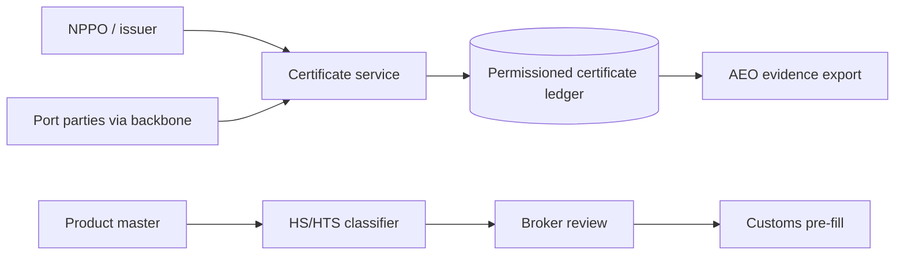

# Phytoseal

**Source:** `ai-in-decentralized+ai/Blockchain, IoT, AI/`
**Domain:** `ai-decentralized`
**One-liner:** A port-network certificate and classification desk that notarises phytosanitary (and similar) documents on a shared ledger and uses AI to propose HS/HTS codes so customs and AEO trusted-trader flows stop drowning in paperwork.
**Wedge:** Antwerp-class port communities and forwarders digitising plant-product certificates first (NPPO export → import presentation), then expanding to related authorisations — paired with AI assist for the “200 new material numbers a day” master-data pain.
**Positioning:** Maritime document authenticity + classification assist. The conference deck shows blockchain pilots for FAVV ePhyto, NxtPort’s one-connection data backbone versus combinatorial party links, paperwork up to 50% of container cost, ~30 organisations and 200+ interactions per shipment, and Deloitte Next-Gen AEO combining RPA, IoT, AI, and blockchain for goods classification.

## Market research synthesis

### Thesis from source

Maritime supply-chain speakers argue ICT innovation is required for cost, quality, and growth, asking whether blockchain can integrate the chain. Barriers span economics, multi-jurisdiction law, disclosure policy, missing methodology, security, immutability-versus-correction tension, and cultural resistance. Benefits of distributed ledgers — especially with smart contracts — include lower cost to send/receive information, illicit-transaction avoidance, fewer error corrections, automatic matching, better asset use, and real-time community information; full benefits need companion technologies and standardisation.

Operational pain is quantified: up to 50% of container moving cost related to paperwork; a simple shipment can involve nearly 30 people/organisations and 200+ interactions; truck efficiency issues (empty running / loading averages); multiple stack moves before pickup. The phytosanitary certificate pilot — NPPO of exporting country to NPPO of importing country for plants/plant products — sits on blockchain with smart-contract automation (FAVV ePhyto), with thresholds to practice including legislation, global scope, commercial risk, and time to market.

NxtPort positions a common data-sharing backbone so n parties equal one connection instead of exploding pairwise links, with API/app marketplaces across nautical, port cargo, B2G, hinterland, and E2E visibility. Deloitte’s Next Gen AEO material adds RPA, IoT, AI, and blockchain: AI/VR for goods classification and inspections; trade master data pain quotes include 200 new material numbers daily, outdated HTS/ECCN, million-row material databases, and departing customs experts’ knowledge.

### Buyer & economic model

- **Primary buyer:** Port community platform operator, large forwarder, or customs-compliant shipper seeking AEO-aligned digitisation.
- **Users:** document clerks, customs brokers, NPPO liaison roles, classification analysts, terminal/port IT integrators, trusted-trader compliance leads.
- **Budget owner / value metric:** trade compliance and operations budget; value metric is certificate cycle time, paperwork cost share, and classification backlog age.
- **Competing status quo:** couriered paper certificates, email PDFs, pairwise EDI, tribal knowledge for HS codes.

### Domain constraints

- **Regulatory / trust / safety:** phytosanitary and customs law across jurisdictions; immutability vs need to correct errors; AEO trust frameworks.
- **Data sensitivity:** commercial shipment data and regulatory documents; permissioned sharing among port parties.
- **Change-management realities:** pilot-to-practice friction (legislation, global coverage, commercial risk); parties resist new systems without backbone connectivity.

## Business requirements

- BR-1: Phytosanitary certificates must be registerable with verifiable issuance and presentation status across export and import NPPOs (or their delegated systems).
- BR-2: Smart-contract-style workflow states must automate handoffs without silent alteration of sealed certificate payloads.
- BR-3: Correction or amendment paths must exist without pretending paper never needed amendments — governed amendments with audit trail.
- BR-4: AI classification proposals for HS/HTS (and ECCN where configured) must be reviewable by a human broker before customs filing.
- BR-5: Port parties must connect once to the backbone rather than maintaining N×N bilateral certificate channels for the same document type.
- BR-6: Cycle-time and paperwork-cost proxies must be reportable against the 50%/200-interaction status quo.
- BR-7: AEO / trusted-trader evidence packs must be exportable from certificate and classification histories.
- BR-8: Access policies must respect commercial disclosure limits between competing supply-chain parties.
- BR-9: Generic IoT device telemetry is out of scope except as optional corroborating signals for inspections.
- BR-10: Multi-jurisdiction legal holds must allow suspending auto-presentation when law is unclear.
- BR-11: Knowledge capture must let brokers annotate AI proposals so departing expert know-how is retained.
- BR-12: Onboarding must support forwarders and terminals without replacing their primary TOS overnight.

## User stories

Canonical user stories live in sibling [USER_STORIES.md](USER_STORIES.md).

## System design

### Overview

Phytoseal combines a permissioned certificate ledger, party directory with disclosure policies, workflow automation for issuance/presentation/acceptance, and an AI classification assist service feeding human review queues. It integrates to port community systems in the spirit of a shared backbone.

### Actors & boundaries

- **Actors:** shippers, forwarders, terminals, customs brokers, NPPOs/authorities, platform operator.
- **Trust boundary:** sealed certificate hashes and workflow events on ledger; rich documents in controlled stores; AI sees product descriptions not unrelated commercial terms.
- **Human-in-the-loop points:** classification approval, amendments, legal holds, certificate rejection.

### Core capabilities

1. **Party directory and disclosure policy**
2. **Certificate registration and workflow**
3. **Governed amendments**
4. **AI HS/HTS classification assist**
5. **Broker review queue and knowledge capture**
6. **AEO evidence export**
7. **Legal hold / jurisdiction suspend**

### Conceptual data

- **Primary entities:** PortParty, DisclosurePolicy, Certificate, CertificateEvent, Amendment, ClassificationProposal, BrokerReview, LegalHold, EvidencePack.
- **Critical events:** issued, presented, accepted, rejected, amended, classification proposed/approved, hold placed.
- **Retention / audit needs:** certificate and classification history retained for customs audit windows.

### Integrations (conceptual)

- **Systems of record:** port community systems, customs declarations (PLDA-class), forwarder TMS, product master/MDM.
- **Upstream signals:** NPPO issuance systems, IoT inspection optional feeds.
- **Downstream actions:** customs filing pre-fill, terminal release signals, partner notifications.

### High-level architecture

### Success metrics

- **Leading:** median certificate issue-to-accept time; % classifications approved without rewrite; backbone parties onboarded.
- **Lagging:** paperwork cost share vs baseline; classification backlog age; AEO audit findings on document authenticity.

## OpenAPI skeleton

Canonical HTTP surface lives in sibling [openapi.yaml](openapi.yaml). Summary:

- **Base path:** `/v1/...`
- **Auth:** API key / Bearer JWT.
- **Resource groups:** PortParties, Certificates, Classifications, Amendments, EvidencePacks.
