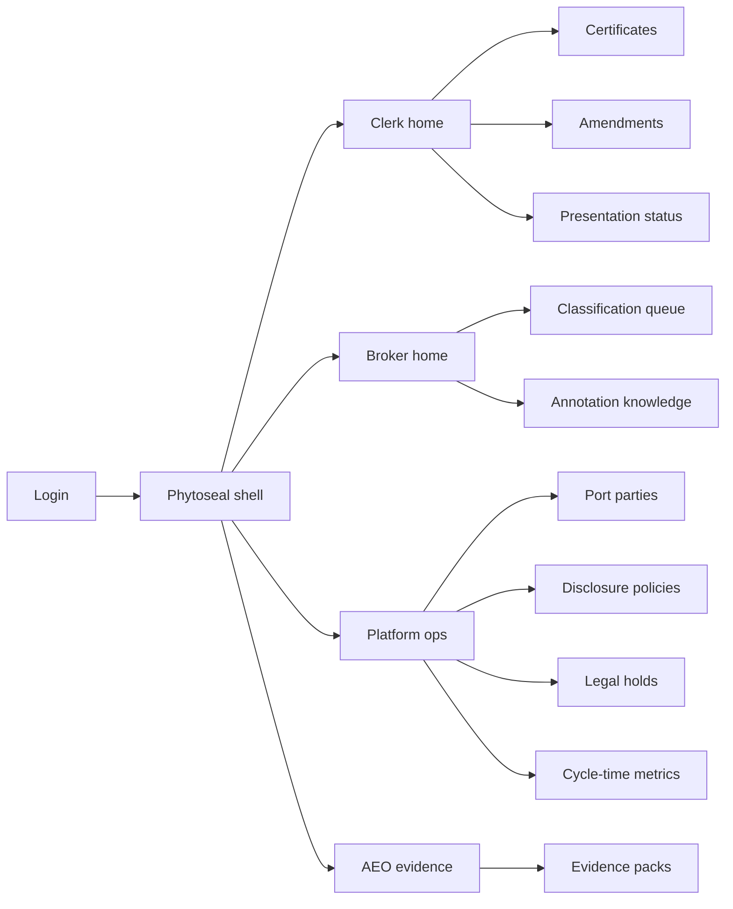
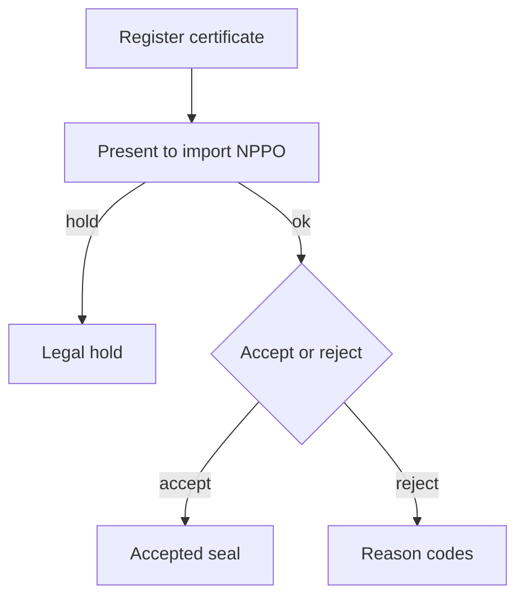
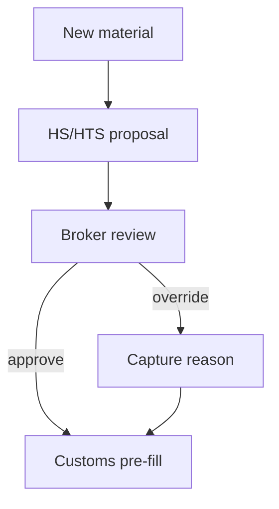

# Phytoseal — Web app

**Product:** [PRODUCT.md](./PRODUCT.md)
**Primary surface:** Port-community certificate and classification desk (forwarder/broker + platform operator under one Phytoseal shell)
**Secondary surfaces:** NPPO presentation status viewer (authority-facing, read-heavy); AEO evidence pack export
**Design thesis:** Phytoseal is a sealed document berth for plant-product trade — not a generic trade BI dashboard. The UI metaphor is a quay-side clearance desk: certificates move through issued → presented → accepted like vessels through locks; HS/HTS proposals sit in a broker review quay beside the sealed document, never auto-filing. Visual language is deep harbour navy with seal-cyan for accepted certificates and amber for legal holds/amendments in flight. The brand wordmark sits as a quiet harbour mark on every authenticity-bearing screen so NPPOs and AEO leads know whose backbone they are trusting.

## UX research synthesis

### Category peers (best-in-class)

- **IPPC ePhyto Hub / national ePhyto portals:** Issuance → exchange → presentation status for phytosanitary certificates. Steal: certificate lifecycle as the primary object; reject pure government portal aesthetics that ignore forwarder backlog and AI classification.
- **NxtPort / port community systems (PCS):** One-connection data backbone, party onboarding, API marketplace. Steal: linear party onboarding vs N×N EDI; reject turning Phytoseal into a full TOS replacement (BR-12).
- **Descartes / CargoWise customs modules:** Broker work queues, HS code workflows, filing pre-fill. Steal: human-authoritative classification review with override reasons; reject black-box “AI classified” without rationale.
- **TradeLens / CargoX (document authenticity):** Permissioned document sharing, hash-backed authenticity. Steal: sealed payload + governed amendment trail; reject immutability theatre that forbids corrections.

### Patterns to adopt / reject

- **Adopt:** Certificate timeline as first-class chrome; disclosure policy chips per party; AI proposal + rationale + broker annotate; legal-hold suspend banner; cycle-time vs 200-interaction baseline; AEO evidence export from histories.
- **Reject:** Auto-file customs from AI without broker; competitor-visible commercial fields; purple logistics glow; IoT telemetry dashboards as home (BR-9); card grids of static “blockchain benefits.”

### Trust, density, and workflow constraints from PRODUCT.md

Clerks need fast issue-to-accept visibility (BR-1, BR-2) without silent payload edits. Amendments must be governed, not denied (BR-3). Classification is assist-only until broker approval (BR-4, BR-11). Backbone onboarding is one connection (BR-5, BR-12). Disclosure policies limit commercial bleed between competitors (BR-8). Legal holds suspend auto-presentation (BR-10). AEO packs export authenticity + review history (BR-7). Cycle-time metrics confront the 50%/200-interaction status quo (BR-6).

## Information architecture

### Nav model

### Roles → default home

| Role | Default home | Why |
|------|--------------|-----|
| Forwarder document clerk | Clerk home — in-flight certificates | Issue → accept focus (BR-1) |
| Customs broker | Classification queue | 200 materials/day assist (BR-4) |
| Port platform operator | Port parties + disclosure | Backbone onboarding (BR-5, BR-8) |
| NPPO liaison | Presentation status | Same sealed record (BR-1) |
| AEO / trusted-trader lead | Evidence packs | Audit artefacts (BR-7) |

### Cross-links to OpenAPI resources

| Nav area | OpenAPI tags / resources |
|----------|---------------------------|
| Parties, disclosure | PortParties |
| Certificates, present, accept/reject | Certificates |
| HS/HTS proposals and reviews | Classifications |
| Governed corrections | Amendments |
| AEO exports | EvidencePacks |

## Screen inventory

### Clerk home

- **Purpose:** Answer “which ePhytos are waiting on import-side acceptance?” in one composition.
- **Entry:** Post-login for document clerks.
- **Layout regions:** Brand + party workspace; certificate KPI strip (issued, presented, accepted, rejected); in-flight table; alerts (legal holds, amendment requests).
- **Primary actions:** Register certificate; open presentation; start amendment.
- **Empty / loading / error:** Empty = register first ePhyto; error = backbone unreachable with retry.
- **BR / story ties:** BR-1, BR-2; clerk stories.

### Certificate detail and timeline

- **Purpose:** Show sealed payload, workflow states, and NPPO presentation without silent alteration.
- **Entry:** Certificate list or deep link from notification.
- **Layout regions:** Sealed document viewer; event timeline (issued → presented → accepted/rejected); party visibility per disclosure policy; hash/attestation strip.
- **Primary actions:** Present; request amendment; export status.
- **Empty / loading / error:** Rejected = reason codes prominent; legal hold = amber suspend banner.
- **BR / story ties:** BR-1, BR-2, BR-8, BR-10.

### Governed amendments

- **Purpose:** Correct inevitable errors without breaking ledger trust.
- **Entry:** Certificate → Amend; amendments nav.
- **Layout regions:** Diff of proposed change; justification; approver chain; prior version access.
- **Primary actions:** Submit amendment; approve/reject; notify counterparties.
- **Empty / loading / error:** No open amendments; validation if sealed fields require re-issuance.
- **BR / story ties:** BR-3; clerk amendment story.

### Classification queue

- **Purpose:** Human review of AI HS/HTS (and ECCN) proposals before customs filing.
- **Entry:** Broker default home.
- **Layout regions:** Queue sorted by backlog age; proposal card (codes, confidence, rationale); product description; outdated HTS/ECCN alerts; annotate/override pane.
- **Primary actions:** Approve; override with reason; defer; push pre-fill to customs.
- **Empty / loading / error:** Empty = caught-up message; low-confidence = forced review flag.
- **BR / story ties:** BR-4, BR-11; broker stories.

### Knowledge capture

- **Purpose:** Retain departing expert know-how as annotations on AI proposals.
- **Entry:** From override actions; broker nav.
- **Layout regions:** Annotation library searchable by material pattern; linked proposals; drift alerts when codes outdated.
- **Primary actions:** Save annotation; promote to team playbook; flag ECCN/HTS drift.
- **Empty / loading / error:** Empty = seed from first overrides.
- **BR / story ties:** BR-11.

### Port parties and backbone onboarding

- **Purpose:** Onboard forwarders/terminals to one connection without replacing TOS overnight.
- **Entry:** Platform ops default.
- **Layout regions:** Party directory; integration status (API connected); document classes enabled; TOS coexistence note.
- **Primary actions:** Invite party; enable certificate class; test connection.
- **Empty / loading / error:** Pending invites; integration error banner.
- **BR / story ties:** BR-5, BR-12.

### Disclosure policies

- **Purpose:** Respect commercial disclosure limits between competing parties.
- **Entry:** Ops → Disclosure.
- **Layout regions:** Policy matrix (document class × party role × fields); competitor blind spots preview.
- **Primary actions:** Publish policy; simulate party view.
- **Empty / loading / error:** Default-deny until policy published.
- **BR / story ties:** BR-8.

### Legal holds

- **Purpose:** Suspend auto-presentation when multi-jurisdiction law is unclear.
- **Entry:** Ops / AEO alerts.
- **Layout regions:** Hold list by jurisdiction; affected certificates; exception report.
- **Primary actions:** Place/release hold; notify clerks.
- **Empty / loading / error:** Empty = no active holds.
- **BR / story ties:** BR-10; AEO exception story.

### Cycle-time metrics

- **Purpose:** Report cycle time and paperwork proxies against 50%/200-interaction status quo.
- **Entry:** Ops / leadership.
- **Layout regions:** Median issue-to-accept; interaction proxy; party coverage; trend vs baseline.
- **Primary actions:** Export period report; filter by commodity.
- **Empty / loading / error:** Insufficient baseline = setup wizard.
- **BR / story ties:** BR-6.

### AEO evidence packs

- **Purpose:** Export certificate authenticity and classification review histories for trusted-trader programs.
- **Entry:** AEO home.
- **Layout regions:** Pack builder (period, parties, document classes); preview of seals + broker reviews; download.
- **Primary actions:** Generate pack; attach to audit case.
- **Empty / loading / error:** No accepted certs in period.
- **BR / story ties:** BR-7.

## Key flows

1. **ePhyto register → accept** — register → present to import NPPO → accept/reject with reason; failure: legal hold suspends presentation.

2. **Governed amendment** — request change → diff + justification → approve → new version linked; sealed history retained (BR-3).

3. **AI classification assist** — MDM material → AI proposal → broker approve/override annotate → customs pre-fill (BR-4, BR-11).

4. **Backbone onboarding** — invite party → one connection → enable ePhyto class → disclosure policy (BR-5, BR-8, BR-12).

5. **AEO pack** — select period → pull seals + classification reviews → export evidence (BR-7).

## Design system

### Tokens (CSS variables)

- `--color-ink: #E7EEF4` — primary text
- `--color-harbour-950: #0A1520` — app ground
- `--color-harbour-900: #122232` — panels
- `--color-harbour-700: #2A4054` — dividers
- `--color-seal: #3DB8C5` — accepted / authentic
- `--color-seal-dim: #1A6A72` — seal on dark
- `--color-amber: #D9A04A` — amendment / legal hold
- `--color-coral: #E05A4C` — rejected certificate
- `--color-steel: #7A94A8` — secondary labels
- `--color-brand: #9FCBD4` — Phytoseal wordmark
- `--font-display: "Fraunces", serif` — titles only (harbour authority feel; not cream-terracotta stack)
- `--font-body: "IBM Plex Sans", sans-serif`
- `--font-mono: "IBM Plex Mono", monospace` — HS codes, cert ids, hashes
- `--space-1`…`--space-8`: 4px scale
- `--radius-sm: 4px`; `--radius-md: 8px`
- `--motion-lock: 180ms ease-out` — seal accept flash
- `--motion-hold: 240ms ease-in-out` — legal-hold pulse
- `--motion-queue: 160ms ease-out` — classification row select
- Atmosphere: soft nautical gradient (deep navy → steel mist); faint quay-line texture — no stock container-ship hero in console.

### Typography & brand

- Display (Fraunces) for screen titles; body for workflows; mono for HS/HTS/ECCN and certificate ids.
- Brand wordmark on certificate and evidence screens.
- Login: brand hero; headline (“Seal the certificate. Review the code.”); one CTA.

### Do / don’t

- **Do:** Keep AI subordinate to broker; show disclosure-safe party views; governed amendments with diffs; cycle-time vs paperwork baseline.
- **Don’t:** Auto-file from AI; purple blockchain glow; IoT dashboard as home; editable sealed payloads.

### Accessibility & domain trust cues

- AA+ contrast; accept/reject never colour-only.
- Live regions for presentation status and legal holds.
- Focus: certificate → amendment → classification → evidence.

## Component patterns

- **CertificateTimeline** — issued / presented / accepted / rejected / amended.
- **SealedPayloadViewer** — hash-backed document with disclosure-filtered fields.
- **LegalHoldBanner** — suspends auto-presentation.
- **ClassificationProposalCard** — codes + rationale + confidence.
- **BrokerOverrideAnnotate** — authoritative judgment with knowledge capture.
- **DisclosurePolicyMatrix** — document class × party visibility.
- **CycleTimeBaseline** — vs 50%/200-interaction status quo.
- **AeoEvidencePackBuilder** — authenticity + review history export.

## Out of scope for v1 web

- Full terminal operating system; generic IoT fleet telemetry as primary product (BR-9); consumer retail tracking apps; multi-modal booking engine; VR inspection suite; replacement of national customs declaration systems.
